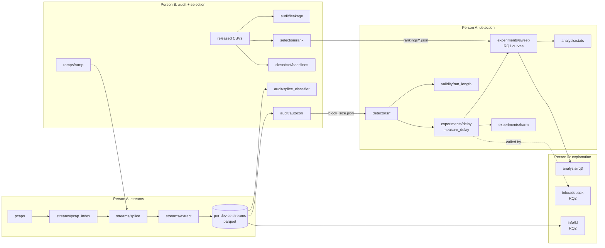

# Architecture

**Before the Device Goes Dark: how feature compression delays attack detection on medical IoT devices**

This file is the map. It says what each module does, who owns it, what crosses between the two halves, and which test closes which gate. If the code and this file disagree, fix one of them in the same PR.

This scaffold holds no code. Every `.py` name below is a planned file. Each folder has a README that specifies what its code must do, so either of you can write it to the same plan.

---

## 0. Repository layout

```
iomt-open-set-feature-selection/
├── README.md                  what the study is, where to start
├── ARCHITECTURE.md            this file
├── CONTRIBUTING.md            rules: gates, branches, handoffs, protocol changes
├── MIGRATION.md               moving from v1 (ANN + GA) to this layout
├── ENVIRONMENT.md             per-machine setup record
├── .github/
│   ├── CODEOWNERS             the A/B split, enforced in review
│   └── pull_request_template.md
├── protocol/
│   ├── protocol.yaml          every pre-committed choice (v2)
│   ├── protocol.sha256        written at the freeze
│   └── CHANGELOG.md           every post-freeze change and what it invalidates
├── data/
│   ├── raw/                   pcaps + CSVs (not committed; CHECKSUMS only)
│   ├── interim/               parsed packets (not committed)
│   └── processed/
│       ├── streams/           per-device window streams (not committed)
│       └── streams_manifest.json   SHA-256 per stream (committed)
├── src/iomt/
│   ├── contracts.py           shared schemas                         [both]
│   ├── protocol.py            load + hash check                      [both]
│   ├── stubs.py               synthetic data for parallel work       [both]
│   ├── streams/               pcaps → per-device streams             [A]
│   ├── ramps/                 slow SYN and MQTT publish ramps         [B]
│   ├── audit/                 leakage, splice classifier, block size  [B]
│   ├── selection/             3 selectors, held-out family            [B]
│   ├── closedset/             closed-set baselines per k              [B]
│   ├── detectors/             benign score, e-detector, CUSUM, threshold [A]
│   ├── validity/              run-length audit                        [A]
│   ├── experiments/           measure_delay, RQ1 sweep, harm          [A]
│   ├── info/                  KL estimation, add-back (RQ2)           [B]
│   ├── analysis/              stats [A], RQ3 [B], figures [both]
│   └── replication/           IoMT-TrafficData                        [A]
├── tests/
│   ├── gates/                 one test per gate item
│   └── checks/                held-out isolation, splice at chance
├── scripts/                   verify_protocol.py (kept from v1)
├── results/
│   ├── rankings/              B → A handoff (committed)
│   ├── audit/                 B → A handoff (committed)
│   ├── raw/                   per-run delay records (not committed)
│   └── aggregated/            paper tables (committed)
├── runs/                      run logs (not committed)
├── figures/                   generated (not committed)
└── paper/                     sections, owner per section
```

---

## 1. The pipeline in one picture



Solid arrows are data. The dotted arrow is a function call: B's add-back ablation calls A's `measure_delay`. That function's signature is frozen (section 4).

---

## 2. Layers

| Layer | What it holds | Committed? |
|---|---|---|
| `protocol/` | Every choice fixed before results: attack set, k grid, selectors, detectors, false-alarm target, thresholds | Yes, hashed |
| `data/raw/` | pcaps and released CSVs | No. `CHECKSUMS` only |
| `data/processed/streams/` | Per-device window streams (parquet) | No. `streams_manifest.json` only |
| `results/rankings/`, `results/audit/` | Handoff artefacts between A and B (small JSON) | Yes |
| `results/raw/` | Per-run delay records | No |
| `results/aggregated/` | Tables the paper is written from | Yes |
| `src/iomt/` | All code, one package | Yes |
| `tests/` | Contract tests (run in CI) and gate tests (run on real data) | Yes |

Handoff artefacts go through a PR like code. If B's block size changes, A sees it in review instead of discovering it from a broken run.

---

## 3. Modules and owners

| Module | Owner | Task in the split | RQ |
|---|---|---|---|
| `contracts.py`, `protocol.py`, `stubs.py` | Both | Shared interfaces | all |
| `streams/` | A | Stream construction from pcaps | infra |
| `ramps/` | B | Slow ramps of SYN and MQTT publish floods | infra |
| `audit/leakage.py` | B | Leakage audit of released CSVs | benchmark |
| `audit/splice_classifier.py` | B | Splice-point classifier with power check | benchmark |
| `audit/autocorr.py` | B | Autocorrelation and block size | validity |
| `detectors/` | A | Conformal e-detector, CUSUM, fixed threshold, benign-only score | RQ1 |
| `validity/run_length.py` | A | Run-length audit | validity |
| `selection/` | B | Three selectors, k sweep, held-out family | RQ1, RQ3 |
| `closedset/` | B | Closed-set baselines at each k | RQ1 contrast |
| `experiments/delay.py`, `experiments/sweep.py` | A | RQ1 delay-cost curves | **RQ1 (novel 1)** |
| `info/kl.py` | B | KL estimation with bootstrap | **RQ2 (novel 2)** |
| `info/addback.py` | B | Add-back ablation | RQ2 |
| `analysis/rq3.py` | B | Selector comparison | RQ3 |
| `analysis/stats.py` | A | Mixed-effects, Wilcoxon + Holm, equivalence | all |
| `experiments/harm.py` | A | Harm case study | case study |
| `replication/` | A | IoMT-TrafficData replication | all |

`.github/CODEOWNERS` encodes this table. Change both together.

### Mapping from v1

| v1 folder | v2 |
|---|---|
| `src/data/` | Split into `streams/` (A) and `audit/` (B) |
| `src/models/` (MLP, stub trainer) | Gone. MLP survives only as a closed-set baseline in `closedset/` |
| `src/openset/` | Gone. Held-out family rule moves into `selection/` |
| `src/selection/` (NSGA-II) | Replaced by three filter rankings in `selection/` |
| `src/experiments/` | Kept as a name; now holds `measure_delay` and the k sweep |
| `src/analysis/` | Kept; split into `stats.py` (A) and `rq3.py` (B) |
| `tests/test_gate_00`–`11` | Replaced by gate items 1–6 in `tests/gates/` |

---

## 4. Contracts

Four things cross between A and B. When code arrives, their schemas go in `src/iomt/contracts.py`, and a contract test checks them against the stubs in CI. Until then, these tables are the agreement.

### 4.1 Window stream (A → B)

One parquet file per stream under `data/processed/streams/`, one row per window.

| Column | Type | Meaning |
|---|---|---|
| `stream_id` | str | Unique per spliced stream |
| `device_id` | str | Target device or broker |
| `t_start`, `t_end` | float | Window bounds, seconds from stream start |
| `segment` | str | `benign` or `attack` |
| `family` | str | Attack family, or `benign` |
| `attack_id` | str | The individual attack (unit of analysis); empty for benign-only streams |
| `onset_t` | float | Attack start in seconds; NaN for benign-only streams |
| `splice_id` | str | Which capture boundary this window sits next to |
| feature columns | float | Exactly the names in `protocol.features` |

`data/processed/streams_manifest.json` lists every stream file with its SHA-256, so both machines can confirm they hold identical streams.

### 4.2 Feature ranking (B → A)

`results/rankings/{selector}__holdout-{family}.json`

```json
{
  "selector": "mi",
  "held_out_family": "arp_spoofing",
  "trained_on_families": ["recon", "malformed_mqtt", "..."],
  "ranking": ["feature names, best first, all of them"],
  "protocol_sha256": "...",
  "git_sha": "..."
}
```

One ranking gives every k. `tests/checks/test_holdout_isolation.py` fails if `held_out_family` appears in `trained_on_families`.

### 4.3 Block size (B → A)

`results/audit/block_size.json`: `block_windows` (int), the ACF threshold used, per-device lags, protocol hash. A's detectors read this file and nothing else for block size.

### 4.4 Delay record (A → B, and into stats)

`DelayRecord` in `contracts.py`: stream, attack, family, selector, k, detector, seed, onset time, alarm time, delay in seconds (NaN on a miss), detected-within-horizon flag, pre-onset false alarms, benign hours. Misses stay in the table.

### 4.5 Frozen function: `measure_delay`

Lives in `src/iomt/experiments/delay.py`, owned by A, called by B.

| Input | Meaning |
|---|---|
| streams | Window streams in the 4.1 schema |
| features | The feature subset to use (any subset, any order) |
| detector | One of `protocol.detectors.names` |
| seed | Run seed |
| cfg | Loaded protocol |

**Returns** a list of delay records in the 4.4 schema, one per attack stream.

B's add-back ablation calls it with chosen subsets. Until A's version lands, B uses a stub with the same inputs and outputs. Write the signature down in the first PR and change it only with both approvals.

---

## 5. Working in parallel

The first code PR should be `src/iomt/stubs.py`: synthetic streams, rankings and delay records that pass the contracts. That one file lets both of you start before real data exists.

- A develops detectors and the sweep against stub streams and stub rankings.
- B develops KL estimation, add-back and RQ3 against stub streams and `stub_measure_delay`.
- Once the gate passes, stub use outside `tests/` is a review blocker.

---

## 6. Gates

Four-week gate, one test file per item. The person in the right-hand column runs it and signs the PR.

| Item | Test | Owner | Closed by |
|---|---|---|---|
| 1. Usable per-device IP streams ≥ 10 | `tests/gates/test_gate_1_stream_count.py` | A | B |
| 2. One stream end to end (benign + ARP spoofing) | `tests/gates/test_gate_2_one_stream.py` | A | B |
| 3. ≥ 3 non-flood classes with enough traffic | `tests/gates/test_gate_3_attack_classes.py` | B | A |
| 4. Autocorrelation measured, block size chosen | `tests/gates/test_gate_4_block_size.py` | B | A |
| 5. e-detector holds nominal run length | `tests/gates/test_gate_5_run_length.py` | A | B |
| 6. Lifecycle phases separable (RQ5 only) | `tests/gates/test_gate_6_phases.py` | A | B |

Pass conditions for each gate are in `tests/gates/README.md`. When written, gate tests carry a `gate` marker and skip while their artefacts are missing. CI runs everything except `gate`, since CI has no data.

Two checks should run in CI on committed artefacts: held-out isolation for every ranking file, and splice classifier at chance with the stated power. Specs are in `tests/checks/README.md`.

---

## 7. What is deliberately absent

- No NSGA-II or GA code. The merged plan uses three filter-style rankings.
- No open-set harness from v1. Leave-one-family-out lives inside `selection/` as the held-out rule.
- No hardware benchmark. CPU latency per k is logged by `experiments/sweep.py`.
